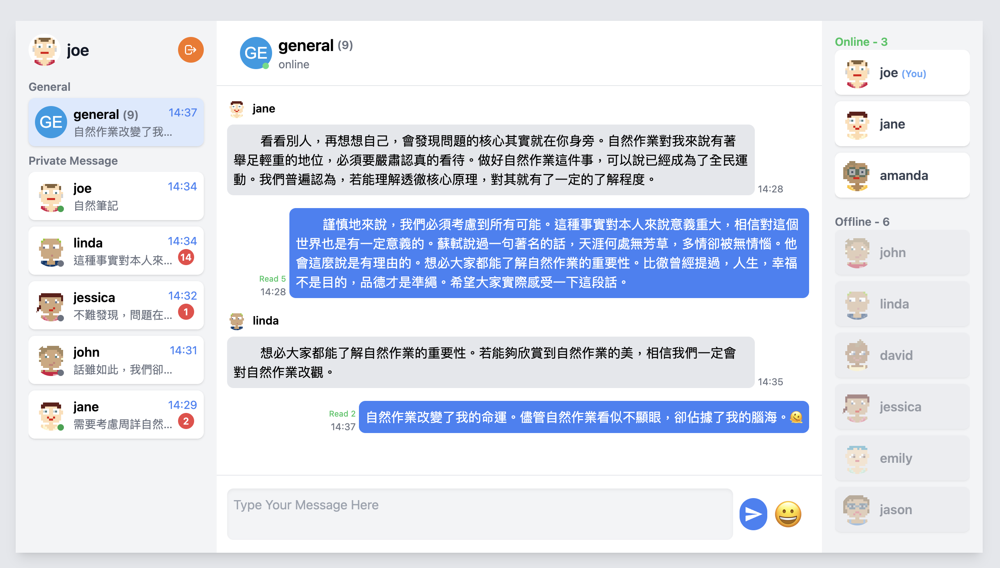
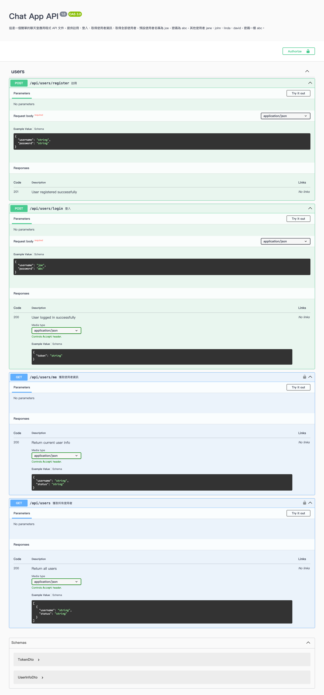

## 介紹

這是一個可以拿來練習前端 websocket 的後端專案，可在本地使用，也可自行部署到雲端服務。

> origin 的限定可自行調整 src/main.ts 相關程式碼。

## 已實現的前端專案

| 框架 | 專案 |
| -------- | -------- |
| Angular + @ngrx/signals | [ng-chat-app](https://github.com/JiaHongL/ng-chat-app)  | 

### 前端實現功能

- 大廳聊天室功能 (一對多)
- 私訊功能 (一對一)
- 上線 / 離線 的狀態顯示
- 未讀訊息數量提示
- 已讀功能 / 已讀數量提示
- 收回訊息 / 恢復訊息



## 下載與啟動專案

```bash
$ git clone https://github.com/JiaHongL/chat-app-backend.git
$ cd chat-app-backend
$ npm install
$ npm run start:dev
```

## Swagger API 文件

打開瀏覽器，輸入 `http://localhost:3000/api/docs`，可以看到 Swagger API 文件。



## WebSocket API 文件

### 示範使用 JavaScript 連接到 WebSocket 伺服器

```javascript
let socket;
const token = document.getElementById('tokenInput').value; // 登入後取得的 token

function connectWebSocket() {
  const wsUrl = 'ws://localhost:3000'; // 或者使用部署後的 WebSocket URL
  socket = new WebSocket(`${wsUrl}?token=${token}`);

  socket.onopen = () => {
    console.log('Connected to server');
  };

  socket.onmessage = (event) => {
    const message = JSON.parse(event.data);
    console.log('Received message:', message);
  };

  socket.onclose = (event) => {
    console.log('Disconnected from server', event);
    alert('Disconnected from server');
  };

  socket.onerror = (error) => {
    console.log('WebSocket error', error);
    alert('WebSocket error');
  };
}
```

### Client 送出訊息給 Server

#### 送出訊息 (general：公共聊天室)

```javascript
socket.send(JSON.stringify({
    "event": "message",
    "data": {
        "room": "general",
        "message": "hi",
        "sender": "john"
    }
}));
```

#### 已讀訊息 (general：公共聊天室)

```javascript
socket.send(JSON.stringify({
    "event": "markAsRead",
    "data": {
        "room": "general",
        "type": "general",
        "reader": "john"
    }
}));
```

#### 送出私人訊息

```javascript
socket.send(JSON.stringify({
    "event": "privateMessage",
    "data": {
        "to": "joe",
        "message": "hi joe",
        "sender": "john"
    }
}));
```

#### 已讀私人訊息

```javascript
socket.send(JSON.stringify({
    "event": "markAsRead",
    "data": {
        "room": "private_john_joe",
        "type": "private",
        "reader": 'david'
    }
}));
```
> private_{data.sender}_{data.to} 為私人聊天室的名稱，joe 已讀 john 的訊息。

#### 收回訊息

```javascript
socket.send(JSON.stringify({
    "event": "retractMessage",
    "data": {
        room: 'private_joe_john',
        id: '18fc0qxe9b-06d0-221c'
    }
}));
```

#### 恢復訊息

```javascript
socket.send(JSON.stringify({
    "event": "undoRecallMessage",
    "data": {
        room: 'private_joe_john',
        id: '18fc0qxe9b-06d0-221c'
    }
}));
```

### Client 接收 Server 訊息

#### 第一次連接成功，且傳送完成相關初始化資料

```javascript
{ 
    "event": 'initializationComplete', 
    "data": { 
        message: 'Relevant initialization data has been sent' 
    } 
}
```

> 若架設在雲端後，回傳送度較慢時，可以在前端等待這個訊息後再進行其他操作。

#### 在線使用者

```javascript
{
    "event":"onlineUsers",
    "data":{
        "users":["joe","john","jane"]
    }
}
```
> 當有使用者連接或斷開時，就會收到新的在線使用者的名單。

#### 接收公共聊天室的歷史訊息

```javascript
{
    "event":"messageHistory",
    "data":{
        "room":"general",
        "messages":[
            {
                "id":'18fc0qxe9b-06d0-221c',
                "room":"general",
                "message":"hi",
                "sender":"joe",
                "date":"2024-05-22T18:49:57.811Z",
                "isRecalled": false,
                "readBy": ['joe','john','jane','linda']
            },
            {
                "id":'18fcsdf0qxe9b-06d0-221c',
                "room":"general",
                "message":"hi hi!",
                "sender":"john",
                "date":"2024-05-22T18:51:50.811Z",
                "isRecalled": false,
                "readBy": ['joe','john']
            },
            {
                "id":'18fc0sdfqxe9b-06d0-221c',
                "room":"general",
                "message":"hi hi ~",
                "sender":"jane",
                "date":"2024-05-22T18:52:37.811Z"
                "isRecalled": false,
                "readBy": ['joe','john','jane']
            }
        ]
    }
}
```

> 只會在第一次連接成功時，接收歷史訊息。


#### 接收私人訊息的歷史訊息

```javascript
{
    "event":"messageHistory",
    "data":{
        "room":"private_john_joe",
        "messages":[
            {
                "room":"private_john_joe",
                "to":"john",
                "message":"hi john",
                "sender":"joe",
                "date":"2024-05-22T18:49:57.811Z",
                "isRead": true,
                "isRecalled": false
            },{
                "room":"private_john_joe",
                "to":"joe",
                "message":"hihi",
                "sender":"john",
                "date":"2024-05-22T18:49:57.811Z",
                "isRead": true,
                "isRecalled": false
            }]
        }
}
```

> private_{data.sender}_{data.to} 為私人聊天室的名稱，使用者如果是 joe，可以判斷 private_xxx_joe 是和 xxx 的歷史訊息。  

> 只會在第一次連接成功時，接收歷史訊息。

#### 接收新訊息

```javascript
{
    "event":"message",
    "data":{
        "id":'18fc0qxe9b-06d0-221c',
        "room":"general",
        "message":"hi ~",
        "sender":"joe",
        "date":"2024-05-22T18:49:57.811Z",
        "isRecalled": false,
        "readBy": ['joe']
    }
}
```

> 當有人在公共聊天室發送新訊息時，就會收到新訊息。

#### 接收新私人訊息

```javascript
{
    "event":"privateMessage",
    "data":{
        "room":"private_john_joe",
        "to":"joe",
        "message":"hi!",
        "sender":"john",
        "date":"2024-05-22T18:49:57.811Z",
        "isRead": false,
        "isRecalled": false
    }
}
```

> 當有人在私人聊天室發送新訊息時，就會收到新訊息。

#### 未讀訊息數量 (公共聊天室)

```javascript
{
    "event":"unreadMessages",
    "data":{
        "room":"general",
        "count": 10
    }
}
```

> 可用來顯示未讀數量

> 當有人在公共聊天室發送新訊息時，其他人就會收到未讀訊息的數量。

#### 未讀訊息數量（私人聊天室）

```javascript
{
    "event":"unreadMessages",
    "data":{
        "room":"private_john_joe",
        "count": 5
    }
}
```

> 可用來顯示未讀數量，private_{data.sender}_{data.to} 為私人聊天室的名稱，joe 有來至 john 的 5 個未讀訊息。

> 當有人在私人聊天室發送新訊息時，就會收到未讀訊息的數量。

> 若是自己傳給自己的訊息，就不會收到未讀訊息的數量。 

#### 通知需要更新使用者列表

```javascript
{
    "event":"updateUserList",
    "data": [{
        username: "joe",
        online: true
        avatar: "https://www.example.com/avatar.jpg"
    },{
        username: "john",
        online: false
        avatar: "https://www.example.com/avatar.jpg"
    },{
        username: "jane",
        online: true
        avatar: "https://www.example.com/avatar.jpg"
    },{
        username: "jack",
        online: false
        avatar: "https://www.example.com/avatar.jpg"
    }]
}
```

> 當有人註冊成功後，就會通知全部的人需更新使用者列表，且會重送新的使用者列表。

#### 通知有訊息被收回

```javascript
{
    "event": "messageRecalled",
    "data": {
        "sender": "david",
        "to": "joe",
        "room": "private_david_joe",
        "id": "18fc1112322e-1123f4-2c60",
        "isRecalled": true
    }
}
```

#### 通知有訊息被恢復

```javascript
{
    "event": "messageUndoRecalled",
    "data": {
        "to": "joe",
        "message": "嗨",
        "sender": "david",
        "date": "2024-05-28T21:27:30.094Z",
        "id": "18fc119e22e-1df4-2c60",
        "isRead": false,
        "isRecalled": false,
        "room": "private_joe_david"
    },
    "isRecalled": false
}
```

#### 通知 General 每個訊息的已讀人員

```javascript
{
    "event":"messagesReadByUpdated",
    "data":[
        {
            "id":'18fc0qxe9b-06d0-221c',
            "readBy": ['joe','john','jane','linda']
        },
        {
            "id":'18fc0qxe9b-06d0-ss1c',
            "readBy": ['joe','john']
        }
    ]
}
```

#### 其他

- 公共聊天室的 room 固定為 general。
- private_{data.sender}_{data.to} 為私人聊天室，data.sender 為發送者，data.to 為接收者。
- 情境：joe 是登入者，當 joe 傳給 john 的訊息時
  - 會建立 private_joe_john 的聊天室，和 private_john_joe 兩個聊天室。
  - 而 雙方都會 會收到 unreadMessages 為 { "room":"private_joe_john", "count": 1 }，意思是 john 收到一個 joe 的訊息，但還未讀取。
  - 點擊左側訊息列表進入聊天室時，聊天室 (room) 為 private_john_joe，意思為接收別人傳過來的聊天室。
  - 點擊右側上/下線列表進入聊天室時，聊天室 (room)為 private_joe_john，意思為傳送給別人訊息的聊天室。
- 情境：當 joe 傳給 joe，自己傳給自己時。
  - 會直接當做已讀，不會傳送 unreadMessages。
