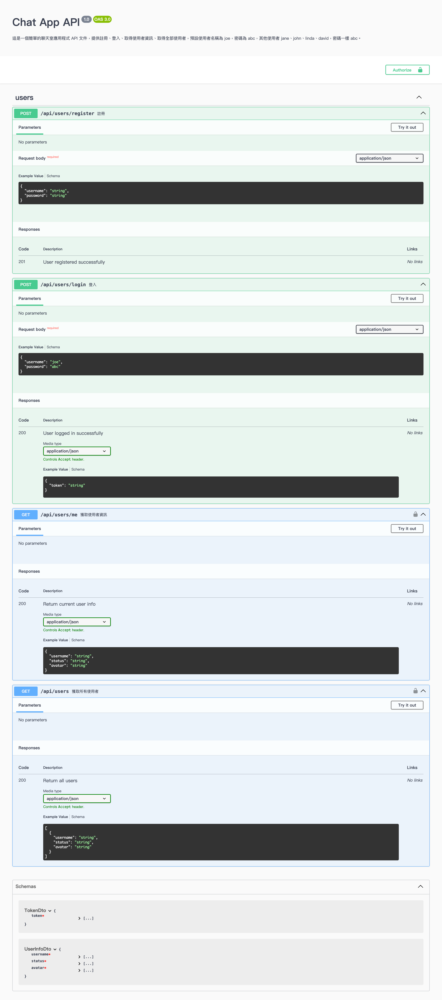

## 介紹

這是一個可以拿來練習前端 websocket 的後端專案，可在本地使用，也可自行部署到雲端服務。

> origin 的限定可自行調整 src/main.ts 相關程式碼。

## Swagger 文件 & 線上測試頁

[swapper](https://chat-app-backend-t7ug.onrender.com/api/docs)  
[chat-app-test-page](https://chat-app-backend-t7ug.onrender.com)

## 下載與啟動專案

```bash
$ git clone https://github.com/JiaHongL/chat-app-backend.git
$ cd chat-app-backend
$ npm install
$ npm run start:dev
```
## Swagger API 文件

打開瀏覽器，輸入 `http://localhost:3000/api/docs`，可以看到 Swagger API 文件。



## WebSocket API 文件

### 示範使用 JavaScript 連接到 WebSocket 伺服器

```javascript
let socket;
const token = document.getElementById('tokenInput').value; // 登入後取得的 token

function connectWebSocket() {
  const wsUrl = 'ws://localhost:3000'; // 或者使用部署後的 WebSocket URL
  socket = new WebSocket(`${wsUrl}?token=${token}`);

  socket.onopen = () => {
    console.log('Connected to server');
  };

  socket.onmessage = (event) => {
    const message = JSON.parse(event.data);
    console.log('Received message:', message);
  };

  socket.onclose = (event) => {
    console.log('Disconnected from server', event);
    alert('Disconnected from server');
  };

  socket.onerror = (error) => {
    console.log('WebSocket error', error);
    alert('WebSocket error');
  };
}
```

### Client 送出訊息給 Server

#### 送出訊息 (general：公共聊天室)

```javascript
socket.send(JSON.stringify({
    "event": "message",
    "data": {
        "room": "general",
        "message": "hi",
        "sender": "john"
    }
}));
```

#### 已讀訊息 (general：公共聊天室)

```javascript
socket.send(JSON.stringify({
    "event": "markAsRead",
    "data": {
        "room": "general",
        "type": "general"
    }
}));
```

#### 送出私人訊息

```javascript
socket.send(JSON.stringify({
    "event": "privateMessage",
    "data": {
        "to": "joe",
        "message": "hi joe",
        "sender": "john"
    }
}));
```

#### 已讀私人訊息

```javascript
socket.send(JSON.stringify({
    "event": "markAsRead",
    "data": {
        "room": "private_john_joe",
        "type": "private"
    }
}));
```
> private_{data.sender}_{data.to} 為私人聊天室的名稱，joe 已讀 john 的訊息。

### Client 接收 Server 訊息

#### 第一次連接成功，且傳送完成相關初始化資料

```javascript
{ 
    "event": 'initializationComplete', 
    "data": { 
        message: 'Relevant initialization data has been sent' 
    } 
}
```

> 若架設在雲端後，回傳送度較慢時，可以在前端等待這個訊息後再進行其他操作。

#### 在線使用者

```javascript
{
    "event":"onlineUsers",
    "data":{
        "users":["joe","john","jane"]
    }
}
```
> 當有使用者連接或斷開時，就會收到新的在線使用者的名單。

#### 接收公共聊天室的歷史訊息

```javascript
{
    "event":"messageHistory",
    "data":{
        "room":"general",
        "messages":[
            {
                "room":"general",
                "message":"hi",
                "sender":"joe",
                "date":"2024-05-22T18:49:57.811Z"
            },
            {
                "room":"general",
                "message":"hi hi!",
                "sender":"john",
                "date":"2024-05-22T18:51:50.811Z"
            },
            {
                "room":"general",
                "message":"hi hi ~",
                "sender":"jane",
                "date":"2024-05-22T18:52:37.811Z"
            }
        ]
    }
}
```

> 只會在第一次連接成功時，接收歷史訊息。

#### 接收私人訊息的歷史訊息

```javascript
{
    "event":"messageHistory",
    "data":{
        "room":"private_john_joe",
        "messages":[
            {
                "room":"private_john_joe",
                "to":"john",
                "message":"hi john",
                "sender":"joe",
                "date":"2024-05-22T18:49:57.811Z"
            },{
                "room":"private_john_joe",
                "to":"joe",
                "message":"hihi",
                "sender":"john",
                "date":"2024-05-22T18:49:57.811Z"
            }]
        }
}
```

> private_{data.sender}_{data.to} 為私人聊天室的名稱，使用者如果是 joe，可以判斷 private_xxx_joe 是和 xxx 的歷史訊息。  

> 只會在第一次連接成功時，接收歷史訊息。

#### 接收新訊息

```javascript
{
    "event":"message",
    "data":{
        "room":"general",
        "message":"hi ~",
        "sender":"joe",
        "date":"2024-05-22T18:49:57.811Z"
    }
}
```

> 當有人在公共聊天室發送新訊息時，就會收到新訊息。

#### 接收新私人訊息

```javascript
{
    "event":"privateMessage",
    "data":{
        "room":"private_john_joe",
        "to":"joe",
        "message":"hi!",
        "sender":"john",
        "date":"2024-05-22T18:49:57.811Z"
    }
}
```

> 當有人在私人聊天室發送新訊息時，就會收到新訊息。

#### 未讀訊息數量 (公共聊天室)

```javascript
{
    "event":"unreadMessages",
    "data":{
        "room":"general",
        "count": 10
    }
}
```

> 可用來顯示未讀數量

> 當有人在公共聊天室發送新訊息時，其他人就會收到未讀訊息的數量。

#### 未讀訊息數量（私人聊天室）

```javascript
{
    "event":"unreadMessages",
    "data":{
        "room":"private_john_joe",
        "count": 5
    }
}
```

> 可用來顯示未讀數量，private_{data.sender}_{data.to} 為私人聊天室的名稱，joe 有來至 john 的 5 個未讀訊息。

> 當有人在私人聊天室發送新訊息時，就會收到未讀訊息的數量。

> 若是自己傳給自己的訊息，就不會收到未讀訊息的數量。 

#### 通知需要更新使用者列表

```javascript
{
    "event":"updateUserList",
    "data": [{
        username: "joe",
        online: true
        avatar: "https://www.example.com/avatar.jpg"
    },{
        username: "john",
        online: false
        avatar: "https://www.example.com/avatar.jpg"
    },{
        username: "jane",
        online: true
        avatar: "https://www.example.com/avatar.jpg"
    },{
        username: "jack",
        online: false
        avatar: "https://www.example.com/avatar.jpg"
    }]
}
```

> 當有人註冊成功後，就會通知全部的人需更新使用者列表，且會重送新的使用者列表。

#### 其他

- 公共聊天室的 room 固定為 general。
- private_{data.sender}_{data.to} 為私人聊天室，data.sender 為發送者，data.to 為接收者。
- 情境：joe 是登入者，當 joe 傳給 john 的訊息時
  - 會建立 private_joe_john 的聊天室，和 private_john_joe 兩個聊天室。
  - 而 john 會收到 unreadMessages 為 { "room":"private_joe_john", "count": 1 }，意思是 john 收到一個 joe 的訊息，但還未讀。
  - 左側訊息通知列點擊後，room 為 private_xxx_joe，意思為接收別人傳過來的聊天室。
  - 右側上下線列表點擊後，room 為 private_joe_xxx，意思為傳送給別人訊息的聊天室。
- 情境：當 joe 傳給 joe，自己傳給自己時。
  - 會直接當做已讀，不會傳送 unreadMessages。
